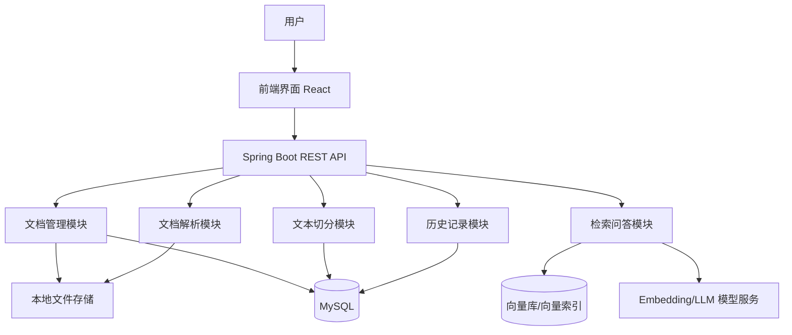
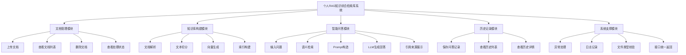
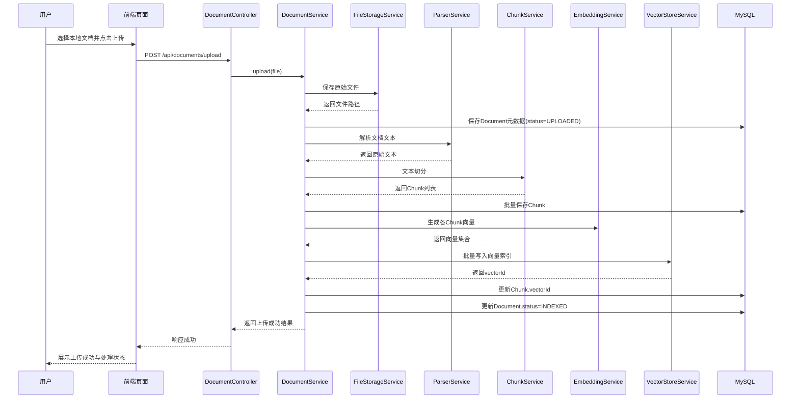
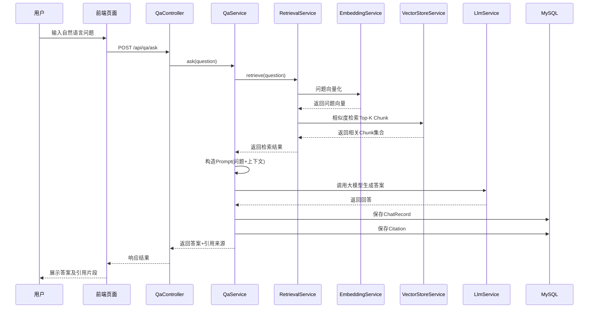
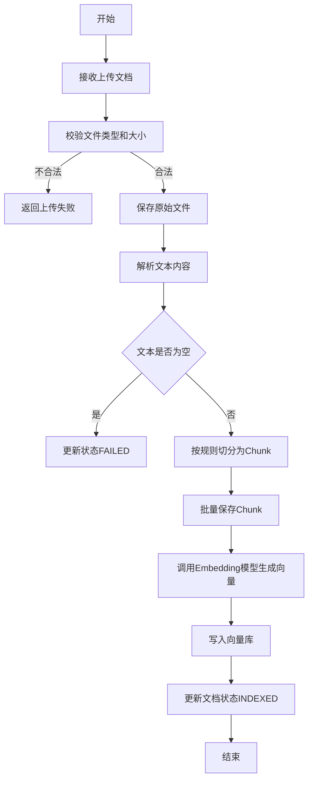
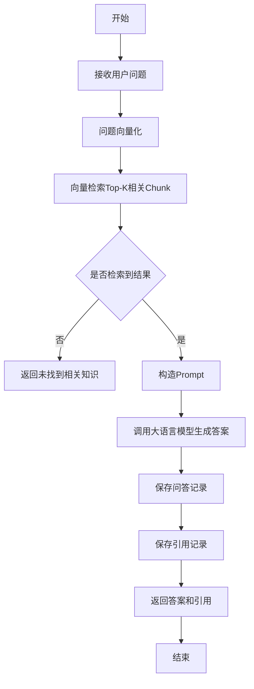
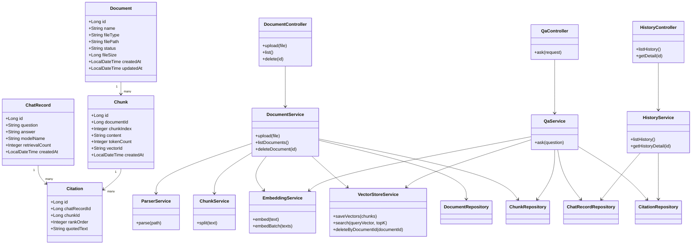

# 个人 RAG 知识综合检索库（KnowBase）系统设计说明书

## 1. 系统体系架构

### 1.1 总体架构设计思想

本系统采用前后端分离与分层模块化相结合的设计思想，整体可划分为：

1. 表现层（UI 层）
2. 接口层（Controller 层）
3. 业务逻辑层（Service 层）
4. 数据访问层（Repository/DAO 层）
5. 基础设施层（文件存储、数据库、向量库、模型服务）

系统围绕“**文档上传 → 文档解析 → 文本切分 → 向量索引 → 语义检索 → RAG 问答 → 历史记录管理**”这一主流程进行构建。该设计延续了前期需求分析中提出的文档管理、知识库构建、智能问答、引用展示和历史记录等核心需求。项目需求分析

### 1.2 系统总体架构图


### 1.3 分层架构说明

#### （1）表示层

表示层主要负责与用户交互，向用户展示文档列表、提问页面、问答结果、引用来源和历史记录等内容。前端采用 React + Vite + Tailwind CSS 实现，具有页面响应快、组件化程度高、便于扩展的特点。项目需求分析

#### （2）接口层

接口层由 Spring Boot 提供 RESTful API，对外暴露文档上传、文档查询、删除文档、提交问题、查询历史记录等接口，并负责参数校验、返回统一格式结果、异常处理等。

#### （3）业务逻辑层

业务逻辑层是系统核心，实现以下关键逻辑：

* 文档上传与元数据保存
* 文档解析与切分
* 文本向量化与索引构建
* 基于 Top-K 检索的知识召回
* Prompt 构造与大模型调用
* 问答记录与引用记录保存

#### （4）数据访问层

数据访问层负责与 MySQL 数据库及向量存储系统交互。MySQL 用于保存文档信息、文本片段、问答记录和引用记录；向量库用于保存文本向量并支持相似度检索。该设计与前述数据建模保持一致。项目需求分析

#### （5）基础设施层

基础设施层包括：

* 本地文件存储目录：保存用户原始上传文档
* MySQL：保存结构化业务数据
* 向量存储：保存 chunk 向量及相似度索引
* Embedding 模型服务：完成文本向量化
* LLM 服务：根据检索结果生成答案

---

## 2. 系统功能结构（层次结构）

### 2.1 功能分解说明

根据需求分析，本系统功能可划分为五个一级模块：

1. 文档管理模块
2. 知识库构建模块
3. 智能问答模块
4. 历史记录模块
5. 系统支撑模块

这些功能均来源于前期需求规格说明中的核心业务需求与用例分析。项目需求分析

### 2.2 系统功能层次图


### 2.3 功能模块说明

#### 2.3.1 文档管理模块

该模块负责知识源接入，支持用户上传本地文档、查询文档列表、查看处理状态和删除文档。其主要作用是为知识库构建提供原始数据输入。

#### 2.3.2 知识库构建模块

该模块是 RAG 系统的基础部分，对上传文档进行文本提取、切分、向量化与索引构建。文档只有在成功完成该模块处理后，才能用于问答检索。

#### 2.3.3 智能问答模块

该模块接收用户自然语言问题，通过语义检索找到最相关的知识片段，再将检索结果与问题共同输入大语言模型，生成最终答案，并返回引用来源。

#### 2.3.4 历史记录模块

该模块负责保存用户每次问答的输入问题、生成答案、模型名称、引用信息和时间，便于后续复盘与知识沉淀。项目需求分析

#### 2.3.5 系统支撑模块

系统支撑模块用于保障系统运行的健壮性与可维护性，包括统一异常处理、文件合法性校验、日志记录和统一响应封装。

---

## 3. 系统用例的时序图（顺序图）以及说明

这里选取两个最核心的用例：

1. 文档上传并建立索引
2. 智能问答

这两个流程本身在需求分析中已经有初步时序图，这里在系统设计阶段进一步细化。项目需求分析

---

### 3.1 用例一：文档上传与索引构建时序图


### 3.2 时序图说明

该时序图反映了文档从进入系统到可被检索的完整过程，包含以下关键步骤：

第一，用户通过前端页面上传文档，前端调用上传接口。

第二，后端先保存原始文件，再保存文档元数据，以确保文件和数据库记录一致。

第三，解析服务从文件中提取纯文本内容，再由切分服务将长文本拆分为多个 chunk。

第四，系统将 chunk 保存到数据库，并调用嵌入模型生成向量，随后写入向量库。

第五，待全部向量索引写入成功后，将文档状态更新为 `INDEXED`，表示该文档已可参与语义检索。

该流程对应需求中“上传文档—解析—切分—向量化—索引构建”的知识库建立过程。项目需求分析

---

### 3.3 用例二：智能问答时序图


### 3.4 时序图说明

该时序图描述了用户提交问题后的完整 RAG 问答过程：

第一，系统接收到用户问题后，首先将问题向量化。

第二，利用向量检索模块从知识库中召回语义最相关的 Top-K 片段。

第三，将问题与召回片段共同拼装为 Prompt，调用大语言模型生成答案。

第四，系统保存问答记录与引用信息，最后将答案和引用来源返回给前端展示。

这一流程体现了系统“先检索、后生成”的设计思想，能够降低模型脱离知识库任意作答的问题，提高回答的可解释性与可信度。选题报告

---

## 4. 复杂功能的算法设计

本系统中最复杂、最核心的功能是“**RAG 智能问答流程**”与“**文档切分与索引构建流程**”。下面分别给出算法流程图与伪代码设计。

---

### 4.1 算法一：文档切分与索引构建算法

#### 4.1.1 算法目标

将上传文档转换为结构化 chunk 与可检索向量索引，供后续问答使用。

#### 4.1.2 算法流程图


#### 4.1.3 伪代码
```
Algorithm BuildKnowledgeIndex(file):
    Input: 用户上传文档 file
    Output: 文档索引构建结果

    1. if file.type not in allowedTypes:
           return "文件类型不支持"

    2. if file.size > maxSize:
           return "文件大小超限"

    3. path ← saveFileToLocal(file)

    4. documentId ← saveDocumentMetadata(file.name, path, status="UPLOADED")

    5. text ← parseText(path)

    6. if text is null or empty:
           updateDocumentStatus(documentId, "FAILED")
           return "文档解析失败"

    7. chunkList ← splitText(text, chunkSize, overlapSize)

    8. saveChunks(documentId, chunkList)

    9. vectors ← embedding(chunkList)

    10. vectorIds ← saveVectorsToStore(documentId, chunkList, vectors)

    11. updateChunkVectorIds(chunkList, vectorIds)

    12. updateDocumentStatus(documentId, "INDEXED")

    13. return "索引构建完成"
```


### 4.1.4 设计说明

该算法设计保证了：

* 文件必须先校验合法性；
* 原始文档与数据库元数据先落盘，避免中途中断导致不可追踪；
* 解析失败时能回写状态；
* 通过 chunk + overlap 方式增强上下文连续性；
* 向量与 chunk 建立映射，便于检索结果反查原文。

---

### 4.2 算法二：RAG 智能问答算法

#### 4.2.1 算法目标

针对用户自然语言问题，从知识库中检索最相关片段，并结合大语言模型生成答案与引用。

#### 4.2.2 算法流程图


#### 4.2.3 伪代码
```
Algorithm RAGAnswer(question):
    Input: 用户问题 question
    Output: 回答 answer 和引用 citations

    1. if question is null or empty:
           return "问题不能为空"

    2. queryVector ← embedding(question)

    3. retrievedChunks ← similaritySearch(queryVector, topK)

    4. if retrievedChunks is empty:
           saveChatRecord(question, "未找到相关知识内容")
           return "知识库中暂无相关内容"

    5. context ← concat(retrievedChunks)

    6. prompt ← buildPrompt(question, context)

    7. answer ← callLLM(prompt)

    8. chatId ← saveChatRecord(question, answer)

    9. for each chunk in retrievedChunks:
           saveCitation(chatId, chunk.id, chunk.content)

    10. return {answer, retrievedChunks}
```

### 4.2.4 设计说明

该算法体现了 RAG 系统的核心思想：

* 检索优先于生成；
* 没有检索结果时不强行生成答案；
* 保存引用关系，支持结果可解释；
* 检索结果数量 Top-K 可配置，便于后期优化性能与准确率。

---

## 5. 面向对象方法类图的详细设计

### 5.1 类设计思路

系统采用典型的面向对象设计，将不同职责划分到实体类、控制器类、服务类、仓储类和 DTO 类中，遵循高内聚、低耦合原则。

### 5.2 核心类图


### 5.3 核心类职责说明

#### （1）实体类

* `Document`：表示上传文档元数据
* `Chunk`：表示文档切分后的知识片段
* `ChatRecord`：表示一次问答记录
* `Citation`：表示问答中引用了哪些片段

这些实体设计与前述 ER 图和数据字典一一对应。项目需求分析

#### （2）控制器类

* `DocumentController`：负责文档上传、列表查询、删除接口
* `QaController`：负责接收提问请求
* `HistoryController`：负责历史记录查询接口

#### （3）服务类

* `DocumentService`：处理文档接入与索引建立流程
* `ParserService`：负责不同文档类型的文本解析
* `ChunkService`：负责文本切分
* `EmbeddingService`：负责文本向量化
* `VectorStoreService`：负责向量写入与检索
* `QaService`：负责完整 RAG 问答流程
* `HistoryService`：负责历史记录查询

#### （4）仓储类

各 `Repository` 类负责持久化操作，屏蔽底层 SQL 细节，提高系统可维护性。

---

## 6. 接口设计

### 6.1 接口设计原则

系统接口采用 RESTful 风格，统一使用 JSON 作为数据交换格式。上传文件接口使用 `multipart/form-data`。接口响应结构统一如下：
```JSON
{
  "code": 200,
  "message": "success",
  "data": {}
}
```

### 6.2 文档管理接口

#### 6.2.1 上传文档接口

* 接口地址：`POST /api/documents/upload`
* 功能描述：上传文档并触发索引构建
* 请求类型：`multipart/form-data`

请求参数：

| 参数名 | 类型 | 必填 | 说明 |
| --- | --- | --- | --- |
| file | File | 是 | 用户上传的文档 |

响应示例：

#### 6.2.2 查询文档列表接口

* 接口地址：`GET /api/documents`
* 功能描述：获取文档列表及处理状态

响应字段：
```JSON
{
  "code": 200,
  "message": "上传成功",
  "data": {
    "documentId": 1,
    "name": "Java并发笔记.pdf",
    "status": "INDEXED"
  }
}
```

| 字段名 | 类型 | 说明 |
| --- | --- | --- |
| id | Long | 文档ID |
| name | String | 文档名称 |
| fileType | String | 文档类型 |
| status | String | 处理状态 |
| createdAt | String | 上传时间 |

#### 6.2.3 删除文档接口

* 接口地址：`DELETE /api/documents/{id}`
* 功能描述：删除文档、对应 chunk 和向量索引

---

### 6.3 问答接口

#### 6.3.1 提问接口

* 接口地址：`POST /api/qa/ask`
* 功能描述：接收问题并返回答案与引用来源
* 请求类型：`application/json`

请求示例：
```JSON
{
  "question": "什么是 JVM 的垃圾回收机制？"
}
```

响应示例：
```JSON
{
  "code": 200,
  "message": "success",
  "data": {
    "question": "什么是 JVM 的垃圾回收机制？",
    "answer": "垃圾回收机制是 JVM 自动管理内存的一种机制……",
    "citations": [
      {
        "documentName": "JVM学习笔记.md",
        "chunkId": 15,
        "content": "垃圾回收（GC）是自动释放不再使用对象内存的机制……"
      }
    ]
  }
}
```

---

### 6.4 历史记录接口

#### 6.4.1 查询历史列表接口

* 接口地址：`GET /api/history`
* 功能描述：按时间倒序返回问答历史

#### 6.4.2 查询历史详情接口

* 接口地址：`GET /api/history/{id}`
* 功能描述：查询某一条问答记录详情及引用信息

---

### 6.5 接口异常设计

当接口调用失败时，系统应返回统一错误信息，例如：
```JSON
{
  "code": 500,
  "message": "模型服务调用失败",
  "data": null
}
```

常见错误包括：

* 文件类型不支持
* 文件大小超限
* 文档解析失败
* 向量化失败
* 模型调用失败
* 问题内容为空
* 历史记录不存在

---

## 7. 数据库物理设计

系统需要保存文档、文本片段、问答记录和引用记录，因此采用 MySQL 进行物理存储。前期需求分析中已经给出了 ER 图与数据字典，这里进一步给出物理表设计。项目需求分析

### 7.1 数据库命名规则

* 数据库名：`knowbase`
* 表名前缀：可统一为无前缀或 `kb_`
* 主键统一使用 `bigint`
* 时间字段统一使用 `datetime`
* 状态字段统一使用 `varchar`

---

### 7.2 文档表设计
```SQL
CREATE TABLE document (
    id BIGINT PRIMARY KEY AUTO_INCREMENT,
    name VARCHAR(255) NOT NULL,
    file_type VARCHAR(50) NOT NULL,
    file_path VARCHAR(500) NOT NULL,
    status VARCHAR(50) NOT NULL,
    file_size BIGINT,
    created_at DATETIME NOT NULL DEFAULT CURRENT_TIMESTAMP,
    updated_at DATETIME NOT NULL DEFAULT CURRENT_TIMESTAMP ON UPDATE CURRENT_TIMESTAMP
);
```

### 7.3 片段表设计
```SQL
CREATE TABLE chunk (
    id BIGINT PRIMARY KEY AUTO_INCREMENT,
    document_id BIGINT NOT NULL,
    chunk_index INT NOT NULL,
    content TEXT NOT NULL,
    token_count INT,
    vector_id VARCHAR(255),
    created_at DATETIME NOT NULL DEFAULT CURRENT_TIMESTAMP,
    CONSTRAINT fk_chunk_document FOREIGN KEY (document_id) REFERENCES document(id)
);
```

### 7.4 问答记录表设计
```SQL
CREATE TABLE chat_record (
    id BIGINT PRIMARY KEY AUTO_INCREMENT,
    question TEXT NOT NULL,
    answer TEXT,
    model_name VARCHAR(100),
    retrieval_count INT,
    created_at DATETIME NOT NULL DEFAULT CURRENT_TIMESTAMP
);
```

### 7.5 引用记录表设计
```SQL
CREATE TABLE citation (
    id BIGINT PRIMARY KEY AUTO_INCREMENT,
    chat_record_id BIGINT NOT NULL,
    chunk_id BIGINT NOT NULL,
    rank_order INT,
    quoted_text TEXT,
    CONSTRAINT fk_citation_chat FOREIGN KEY (chat_record_id) REFERENCES chat_record(id),
    CONSTRAINT fk_citation_chunk FOREIGN KEY (chunk_id) REFERENCES chunk(id)
);
```

### 7.6 索引设计

为提高检索效率，可增加如下索引：
```SQL
CREATE INDEX idx_document_status ON document(status);
CREATE INDEX idx_chunk_document_id ON chunk(document_id);
CREATE INDEX idx_chat_created_at ON chat_record(created_at);
CREATE INDEX idx_citation_chat_id ON citation(chat_record_id);
```

### 7.7 物理设计说明

* `document` 表保存原始文档元信息；
* `chunk` 表保存切分后的知识片段；
* `chat_record` 表保存问题与回答；
* `citation` 表保存回答与知识片段之间的引用关系；
* 向量数据可不直接保存在 MySQL 中，而由向量库独立管理，数据库中通过 `vector_id` 建立映射。

这样的设计既满足课程项目对关系数据库设计的要求，也适配 RAG 系统“结构化数据 + 向量数据分离存储”的实现方式。

---

## 8. UI（界面）设计

### 8.1 UI 设计原则

系统面向个人用户使用，因此界面设计应遵循：

1. 简洁清晰
2. 操作路径明确
3. 核心功能突出
4. 结果展示可解释
5. 便于后续扩展

这一原则与需求说明中的可用性需求保持一致。项目需求分析

---

### 8.2 页面结构设计

系统主要包括以下页面：

1. 首页 / 控制台
2. 文档管理页面
3. 智能问答页面
4. 历史记录页面

---

### 8.3 页面功能说明

#### 8.3.1 首页 / 控制台

首页展示系统名称、功能入口和知识库概览信息，例如：

* 已上传文档数量
* 已完成索引文档数量
* 历史问答总数
* 最近一次问答时间

页面目的在于帮助用户快速掌握当前知识库总体情况。

---

#### 8.3.2 文档管理页面

页面包含以下区域：

* 文件上传区域
* 文档列表区域
* 文档状态显示区域
* 删除操作按钮

页面草图如下：

设计说明：

* 用户可直接选择本地文件上传；
* 文档列表展示名称、类型、状态和操作；
* 状态可用不同颜色区分，如绿色表示已完成，黄色表示处理中，红色表示失败。

---

#### 8.3.3 智能问答页面

该页面是系统核心页面，包含：

* 问题输入框
* 提交按钮
* 回答展示区
* 引用来源展示区


设计说明：

* 问题输入框支持自然语言；
* 回答区展示最终生成结果；
* 引用区展示引用文档名和片段内容；
* 若未检索到相关内容，应展示提示信息，而不是空白页。

---

#### 8.3.4 历史记录页面

该页面包含：

* 历史问答列表
* 记录时间
* 点击查看详情功能


---

### 8.4 UI 交互设计说明

#### （1）上传交互

用户点击“选择文件”后选择本地文档，再点击“上传按钮”触发上传。上传完成后自动刷新文档列表，并显示处理状态。

#### （2）问答交互

用户输入问题后点击提交，页面应显示加载状态；待系统返回答案后，展示答案与引用来源；若失败，则提示“模型调用失败”或“知识库中暂无相关内容”。

#### （3）历史记录交互

用户点击历史记录条目后，跳转或展开该次问答详情页面，展示完整问题、回答内容与引用来源。

---

### 8.5 前端组件划分建议

可将前端拆分为如下组件：

* `Layout`：整体布局组件
* `DocumentUpload`：上传组件
* `DocumentTable`：文档列表组件
* `QuestionInput`：问题输入组件
* `AnswerPanel`：答案展示组件
* `CitationList`：引用展示组件
* `HistoryList`：历史记录列表组件
* `HistoryDetail`：历史详情组件

这样有利于前端代码复用与维护，也符合组件化开发要求。