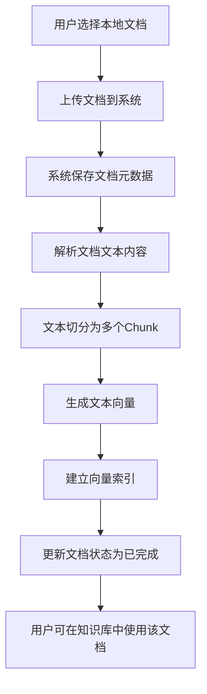
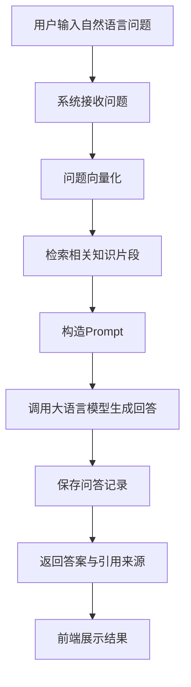
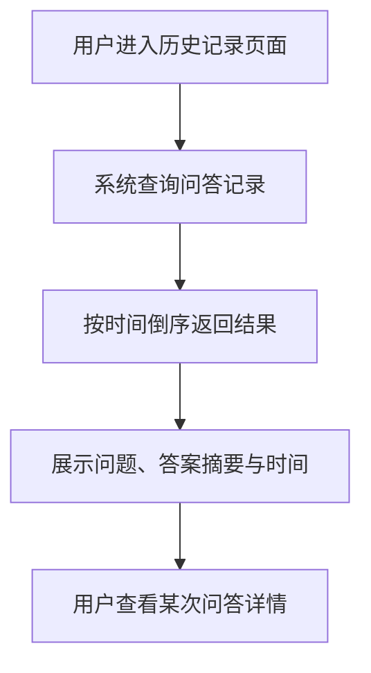
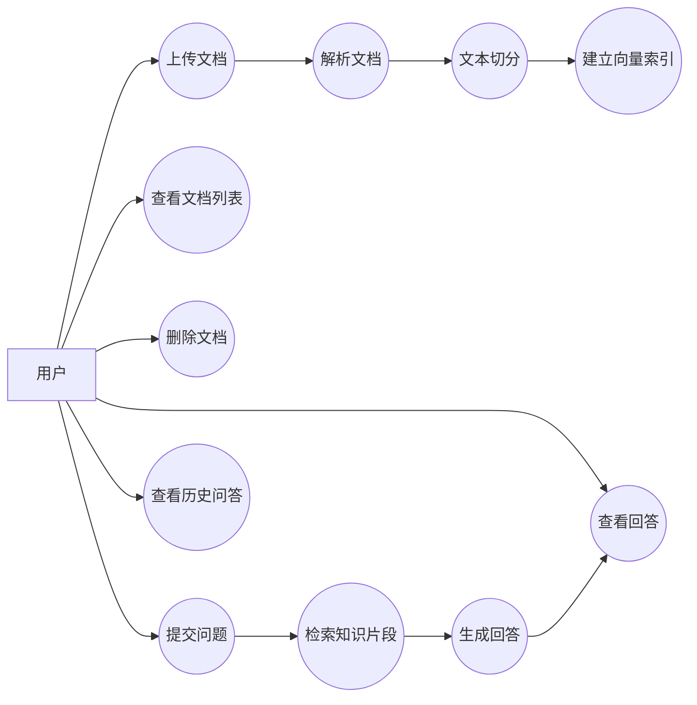
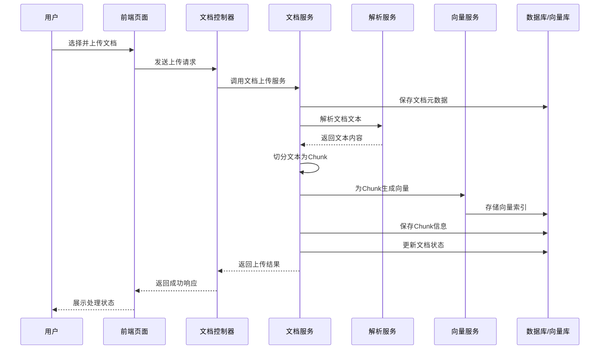
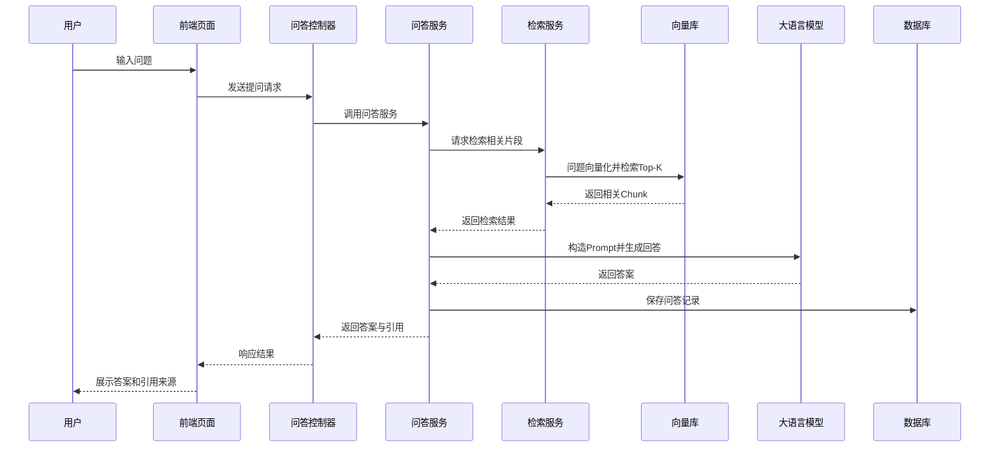
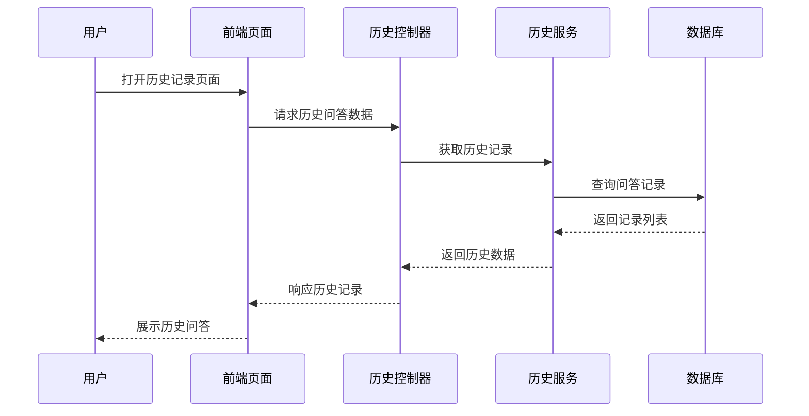
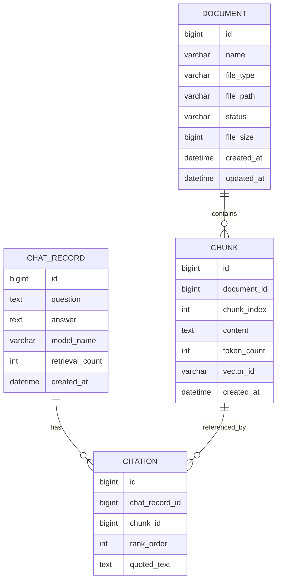

# 个人 RAG 知识综合检索库（KnowBase）需求规格说明书

---

## 1. 用户需求说明

### 1.1 项目概述

本项目拟设计并实现一个面向个人用户的 RAG 知识综合检索库系统。用户可以将个人的学习资料、技术文档、笔记、项目总结等上传到系统中，系统对文档进行解析、切分、向量化和索引构建，最终支持用户通过自然语言进行语义检索与智能问答，从而构建属于自己的个人知识库。

本系统的主要目标是解决以下问题：

* 个人知识资料分散，难以统一管理；
* 传统关键词搜索依赖记忆，检索效率不高；
* 用户希望通过自然语言提问直接获得基于个人资料的回答；
* 用户希望知道回答依据了哪些原始资料内容。

---

### 1.2 用户角色

本项目面向单用户场景，主要角色为：

#### 普通用户

普通用户是系统的核心使用者，主要需求包括：

* 上传和管理个人文档；
* 构建个人知识库；
* 基于知识库进行自然语言提问；
* 查看问答结果及引用来源；
* 查看历史问答记录。

---

### 1.3 用户核心需求

系统需要满足以下核心业务需求：

#### （1）文档上传与管理需求

用户希望能够上传个人文档，并对文档进行统一管理。系统应支持：

* 上传本地文档；
* 查看已上传文档列表；
* 查看文档处理状态；
* 删除不再需要的文档。

#### （2）知识库构建需求

用户希望系统不仅保存文件本身，还能够理解文件中的知识内容。因此系统应支持：

* 提取文档文本内容；
* 对文本进行切分；
* 对文本片段进行向量化；
* 建立语义索引，构建可检索知识库。

#### （3）智能问答需求

用户希望通过自然语言提问，从自己的知识库中快速获取答案。系统应支持：

* 接收自然语言问题；
* 从知识库中检索语义相关片段；
* 基于检索结果生成回答；
* 返回答案及引用来源。

#### （4）结果可解释需求

用户不仅希望得到答案，还希望知道答案依据了哪些资料内容。系统应支持：

* 展示引用文档名称；
* 展示引用文本片段；
* 提升回答结果的可信度和可验证性。

#### （5）历史记录需求

用户希望能够回顾之前的问题和答案。系统应支持：

* 保存问答记录；
* 查看历史问题与答案；
* 支持后续复盘与知识沉淀。

---

### 1.4 User Story

#### 文档管理类

* 作为一个用户，我希望上传我的学习资料和技术文档，以便构建自己的知识库。
* 作为一个用户，我希望查看已上传文档列表，以便了解当前知识库中有哪些内容。
* 作为一个用户，我希望删除不再需要的文档，以便保持知识库整洁。
* 作为一个用户，我希望查看文档的处理状态，以便知道文档是否已经完成索引。

#### 智能问答类

* 作为一个用户，我希望输入自然语言问题，以便更方便地检索个人资料中的知识。
* 作为一个用户，我希望系统返回简洁明确的回答，以便节省自己翻阅文档的时间。
* 作为一个用户，我希望查看回答对应的引用来源，以便确认答案是否可靠。
* 作为一个用户，我希望当知识库中没有相关内容时，系统能够明确告知，而不是随意生成不可靠答案。

#### 历史记录类

* 作为一个用户，我希望保存每次问答记录，以便之后复习或整理知识。
* 作为一个用户，我希望查看历史问答，以便复用过去已经得到的答案。

---

### 1.5 业务流程图

#### 1.5.1 文档上传与知识库构建流程图

#### 1.5.2 智能问答业务流程图

#### 1.5.3 历史记录查看流程图

---

## 2. 需求分析建模

### 2.1 用例图

---

### 2.2 用例说明

#### 用例一：上传文档

* **用例名称**：上传文档
* **参与者**：用户
* **前置条件**：用户已进入系统文档管理页面
* **基本流程**：
   1. 用户选择本地文档；
   2. 系统接收上传请求；
   3. 系统保存文件及元数据；
   4. 系统解析文本并切分；
   5. 系统建立向量索引；
   6. 系统更新文档状态。

* **后置条件**：文档进入知识库并可用于后续检索。

#### 用例二：提交问题

* **用例名称**：提交问题
* **参与者**：用户
* **前置条件**：知识库中至少存在已完成索引的文档
* **基本流程**：
   1. 用户输入问题；
   2. 系统将问题向量化；
   3. 系统检索相关知识片段；
   4. 系统构造提示词；
   5. 系统调用大语言模型生成回答；
   6. 系统返回答案及引用来源；
   7. 系统保存问答记录。

* **后置条件**：用户获得回答，并可查看本次问答记录。

#### 用例三：查看历史问答

* **用例名称**：查看历史问答
* **参与者**：用户
* **前置条件**：系统中存在至少一条问答记录
* **基本流程**：
   1. 用户进入历史页面；
   2. 系统读取历史记录；
   3. 系统按时间倒序返回；
   4. 用户查看某条记录详情。

* **后置条件**：用户成功查看历史问答内容。

---

### 2.3 时序图

#### 2.3.1 文档上传与索引构建时序图

#### 2.3.2 智能问答时序图

#### 2.3.3 历史记录查看时序图

---

### 2.4 数据建模（ER 图）

---

### 2.5 数据字典

#### 2.5.1 Document（文档表）

| 字段名 | 类型 | 是否主键 | 是否可空 | 说明 |
| --- | --- | --- | --- | --- |
| id | bigint | 是 | 否 | 文档唯一标识 |
| name | varchar(255) | 否 | 否 | 文档名称 |
| file_type | varchar(50) | 否 | 否 | 文件类型，如 txt、md、pdf |
| file_path | varchar(500) | 否 | 否 | 文件存储路径 |
| status | varchar(50) | 否 | 否 | 文档处理状态 |
| file_size | bigint | 否 | 是 | 文件大小 |
| created_at | datetime | 否 | 否 | 文档上传时间 |
| updated_at | datetime | 否 | 否 | 文档更新时间 |

**status 推荐取值：**

* UPLOADED
* PARSING
* CHUNKED
* INDEXED
* FAILED

---

#### 2.5.2 Chunk（知识片段表）

| 字段名 | 类型 | 是否主键 | 是否可空 | 说明 |
| --- | --- | --- | --- | --- |
| id | bigint | 是 | 否 | 片段唯一标识 |
| document_id | bigint | 否 | 否 | 所属文档 ID |
| chunk_index | int | 否 | 否 | 片段顺序号 |
| content | text | 否 | 否 | 片段文本内容 |
| token_count | int | 否 | 是 | 片段 token 数估计值 |
| vector_id | varchar(255) | 否 | 是 | 向量存储中的索引标识 |
| created_at | datetime | 否 | 否 | 片段创建时间 |

---

#### 2.5.3 ChatRecord（问答记录表）

| 字段名 | 类型 | 是否主键 | 是否可空 | 说明 |
| --- | --- | --- | --- | --- |
| id | bigint | 是 | 否 | 问答记录唯一标识 |
| question | text | 否 | 否 | 用户提问内容 |
| answer | text | 否 | 是 | 系统回答内容 |
| model_name | varchar(100) | 否 | 是 | 本次问答使用的模型名称 |
| retrieval_count | int | 否 | 是 | 检索到的片段数量 |
| created_at | datetime | 否 | 否 | 问答发生时间 |

---

#### 2.5.4 Citation（引用记录表）

| 字段名 | 类型 | 是否主键 | 是否可空 | 说明 |
| --- | --- | --- | --- | --- |
| id | bigint | 是 | 否 | 引用记录唯一标识 |
| chat_record_id | bigint | 否 | 否 | 对应问答记录 ID |
| chunk_id | bigint | 否 | 否 | 被引用片段 ID |
| rank_order | int | 否 | 是 | 引用顺序 |
| quoted_text | text | 否 | 是 | 返回前端展示的引用文本 |

---

## 3. 非功能性需求说明

### 3.1 开发环境

#### 后端开发环境

* 操作系统：macOS
* 开发语言：Java 21
* 开发框架：Spring Boot
* AI 集成框架：Spring AI
* 构建工具：Maven
* 开发工具：IntelliJ IDEA

#### 前端开发环境

* 开发语言：TypeScript / JavaScript
* 前端框架：React
* 构建工具：Vite
* UI 样式：Tailwind CSS
* 开发工具：VS Code

#### 数据与存储环境

* 关系型数据库：MySQL 8.x
* 文件存储：本地文件系统
* 向量存储：向量数据库或本地向量索引方案
* 模型服务：大语言模型接口、Embedding 模型接口

---

### 3.2 运行环境

* 操作系统：macOS / Linux / Windows
* JDK 运行环境：Java 21
* 数据库运行环境：MySQL 8.x
* 浏览器环境：Chrome、Safari、Edge 等主流浏览器
* 网络环境：系统调用外部大模型与向量化服务时需具备可用网络连接

---

### 3.3 性能需求

* 文档列表查询应在较短时间内返回；
* 普通提问请求应在可接受时间内完成响应；
* 文档上传后应在合理时间内完成文本解析与索引构建；
* 系统应满足单用户个人知识管理场景下的稳定运行。

建议指标如下：

* 文档列表接口响应时间不超过 2 秒；
* 一般问答请求响应时间不超过 10 秒；
* 小型文档处理时间不超过 30 秒。

---

### 3.4 可用性需求

* 系统界面应简洁清晰，便于用户快速上手；
* 上传、问答、查看历史等核心操作路径应明确；
* 对于上传失败、模型调用失败、检索失败等情况，应返回清晰错误提示；
* 回答结果应展示引用来源，增强可理解性与可信度。

---

### 3.5 可靠性需求

* 系统应具备基本的异常处理能力，避免单次请求异常导致整体崩溃；
* 文档处理失败时应记录状态并允许用户重新操作；
* 问答服务异常时应返回可理解的失败提示；
* 文档、片段、问答记录等数据应保持一致性。

---

### 3.6 可维护性需求

* 后端应采用分层设计，至少包括 Controller、Service、Repository、Entity、DTO 等层次；
* 前端应采用组件化开发方式，便于后续维护和扩展；
* 接口命名应统一规范，便于前后端联调；
* 核心业务逻辑应具备必要注释，便于后续修改。

---

### 3.7 安全性需求

* 系统应校验上传文件类型，防止非法文件上传；
* 系统应限制单次上传文件大小；
* 外部模型服务的 API Key 应通过配置文件或环境变量管理，不能硬编码在代码中；
* 系统应避免将敏感配置信息暴露在前端。

---

### 3.8 系统依赖项

#### 后端依赖

* Spring Boot Web
* Spring Data JPA
* MySQL Driver
* Lombok
* Validation
* Spring AI
* 文档解析相关依赖
* 日志依赖

#### 前端依赖

* React
* Vite
* Axios
* React Router
* Tailwind CSS

#### 外部依赖

* Embedding 模型服务
* 大语言模型服务
* 向量存储服务或本地向量索引组件
* 本地文件存储目录
